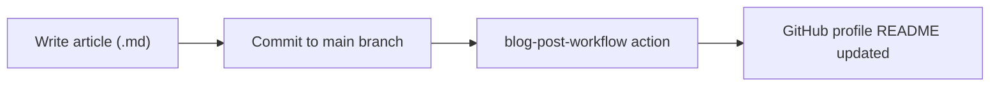

# blog


## Overview
Writing clearly about technical topics is a skill that compounds over time, yet most engineers leave their learnings scattered across notes or entirely undocumented. This repository is a personal blog containing articles on software engineering practices, productivity, and career growth. It is aimed at developers who want to level up their craft through well-structured, experience-driven writing.

## Structure
```sh
blog/
├── 📄 README.md              # This file
└── commits/
    └── 📝 how-to-write-commits.md  # Guide to conventional commits and commit history management
```

## How It Works


## References
- [blog-post-workflow](https://github.com/gautamkrishnar/blog-post-workflow) — GitHub Action that automatically surfaces latest posts on a profile README
- [Conventional Commits](https://www.conventionalcommits.org/en/v1.0.0/#specification) — specification referenced in the commits article
- [mischavandenburg/mischavandenburg](https://github.com/mischavandenburg/mischavandenburg/blob/main/.github/workflows/blog-post-workflow.yml) — workflow structure used as a reference
